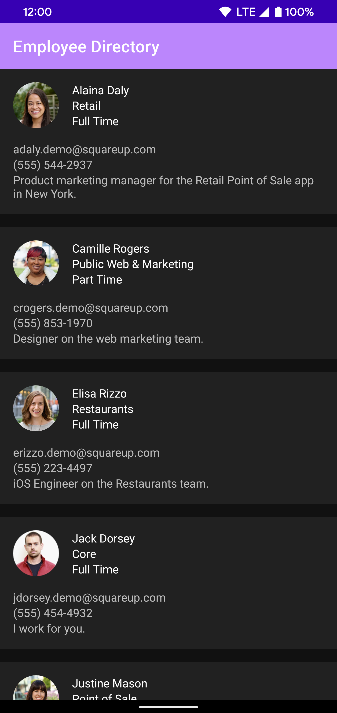

# Screenshots

## Build tools & versions used
* Android Studio Version - Android Studio Bumblebee | 2021.1.1 Patch 2
* Gradle Version - build:gradle:7.1.3
* Build Tools - 30.0.3

## Steps to run the app
* I have been able to run this using an Emulator or a physical device. The version of Android Studio
  that I used to build the application is BumbleBee

## What areas of the app did you focus on?
* I focused on using the MVVM design pattern and packaging by feature to make it easy 
  to navigate the feature in this application.

## What was the reason for your focus? What problems were you trying to solve?
* I think its very important to establish a solid foundation when it comes to choosing a design 
  pattern. This will go a long way in terms of maintainability and extensibility of this application
  as the business logic changes or features are added.

## How long did you spend on this project?
* 4 hours

## Did you make any trade-offs for this project? What would you have done differently with more time?
* I didn't focus on writing any UI tests since the instructions made it clear that Unit Tests were 
  more important. Give more time I would like to add a custom UI, possibly a floating action button, 
  to filter the results. I think a filter by employee type makes a lot of sense. Possibly a grouping 
  by Employee type would also be useful.

## What do you think is the weakest part of your project?
* The weakest part of the project is the lack of a database to cache data that comes down from the API requests.

## Did you copy any code or dependencies? Please make sure to attribute them here!
* I have implemented similar coding patterns in a previous project - https://github.com/lawloretienne/CryptoCoins

## Is there any other information you’d like us to know?
* This was developed with a mobile device in mind. I have not tested this on a Tablet. 

## Caching of Images
* I am using Coil for ImageLoading. They have implemented their own mechanisms for image caching to 
  disk- https://github.com/coil-kt/coil/tree/9feecb8382a34442fe193c84626d778d5f4fb572/coil-base/src/main/java/coil/disk
  
# Architecture

* MVVM 
    * The *ViewModels* I am using extend from the lifecycle-aware ViewModel component. The *Views*
    I am using are Activities. And the *Model* is the Repository.
* Network and Domain Models with Mappers
    * I have separated out the Employee object into different models depending on where the object
    is used. I also have created Mapper interfaces to allowing mapping between the different models.
    This helps to provides a clear understanding of the responsibility. This is in accordance with
    Uncle Bob's Clean Architecture. The important thing is that isolated, simple, data structures
    are passed across the boundaries. We don’t want the data structures to have any kind of dependency 
      that violates The Dependency Rule.
* Repository Pattern
    * This pattern provides a clean API so that the ViewModel can retrieve the data easily without having 
      knowledge of how the datasource fetches the data. In my repository I only have a remote data source 
      which makes the remote API call. There is no local data source to save to a database.
* Kotlin
    * I used Kotlin throughout the project because it is concise in the amount of boilerplate code
    that is reduced. It is safe in that it avoids entire classes of errors such as null pointer
    exceptions. And it is interoperable in that it leverage existing libraries for the JVM, Android,
    and the browser.

# Project Structure
* Core
    * This is where code lives that spans across the different layers of the application
* Data
    * This is my data layer and consists of the Network related classes including the 
      EmployeesService interface, and the Repository class as well as the remote data source
* UI
    * This is the presentation layer. I have set up packages by feature here. This consists of most
    of the view related code. I have also added a domain model as well as a domain mapper.

# Jetpack
* ConstraintLayout
    * Position and size widgets in a flexible way with relative positioning.    
* Multidex
    * Deploy applications with multiple dex files on pre-Android 5 devices.

# Dependency Injection
* Hilt
    * I am using Hilt to simplify the Dagger-related infrastructure

# Testing
* Unit tests
    * I have created unit tests for ViewModels, Repositories, and RemoteDataSources. 
    I prefer to use the Given - When - Then format for my tests.

# Future Improvements
* Espresso tests
    * In the future, it would help to write Android UI tests with Espresso.

  
This project was created with Android Studio Bumblebee
